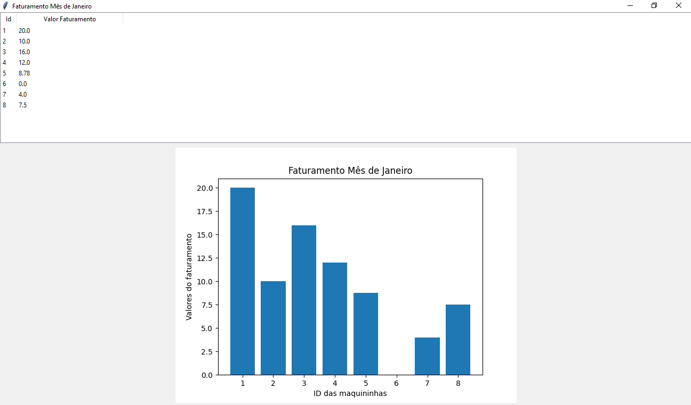

# Nome do Projeto: Faturamento-Maquininhas
**Descrição:** Projeto desenvolvido para processo seletivo da Stone que tem por objetivo automatizar o cálculo de faturamento das maquininhas da rede de franquias, simulando os valores calculados para o mês de Janeiro de 2021.

A entrada do script é um arquivo csv ('eventos.csv') separado por ";" que possui 5 colunas:
- id: Identificador da maquininha (string)
- preço: Preço da maquininha definido pra aquele ponto (decimal)
- evento: Tipo de evento da maquininha. São 4: Ativação, Desativação, Mudança de Preço, Período Promocional (string)
- data_inicial: Validade inicial do preço (date)
- data_final: Validade final do preço (date)

Ao final do script é gerado um arquivo csv ('faturamentos.csv') que possui 2 colunas:
- id: Identificador da maquininha (string)
- valor_faturado: Preço da maquininha faturado para aquele mês. (decimal)

# Pré - Requisitos:
- Versão 3 do python instalada. Encontrada no link: python.org

- Instalação da biblioteca "datetime"
- Instalação da biblioteca "tkinter"
- Instalação da biblioteca "matplotlib.pyplot"
- Instalação da biblioteca "csv"

- Arquivo de entrada localizado na mesma pasta do script

# Instalação:
1. Instalar as dependencias mencionadas acima
   - DATETIME: *pip install datetime*
   - TKINTER: *pip install tkinter*
   - MATPLOTLIB: *pip install matplotlib.pyplot*
   - CSV: *pip install csv*

2. Clonar o repositório
   - git clone https://github.com/Camila7nunes/Faturamento-Maquininhas

# Executando os testes
1. Abrir o arquivo 'main.py' e setar o arquivo de entrada escolhido entre as duas opções disponíveis (eventos.csv, eventosTeste.csv)
   - Caso desejem verificar, há na pasta *arquivoTeste* um arquivo csv com mais alguns dados que também foram utilizados, a nível de teste, durante o desenvolvimento.
2. Executar o arquivo 'main.py' no seu local de preferência
    

## Casos de Teste
| Caso:                                                            | Status |
|------------------------------------------------------------------|:------:|
| Maquininha com apenas evento de ativação                         |   OK   |
| Maquininha sem evento de ativação                                |   OK   |
| Maquininha com apenas eventos de ativação e desativação          |   OK   |
| Maquininha com eventos de mudança de preço e período promocional |   OK   |
| Maquininha com eventos após a desativação                        |   OK   |

# Resultados

**Resultado 1:** Um arquivo final chamado 'faturamentos.csv'.

**Resultado 2:** Tabela em uma janela Tkinter com os dados do arquivo final.

**Resultado 3:** Um gráfico usando matplotlib, com a exibição do faturamento de todas as maquininhas no formato de barras.

